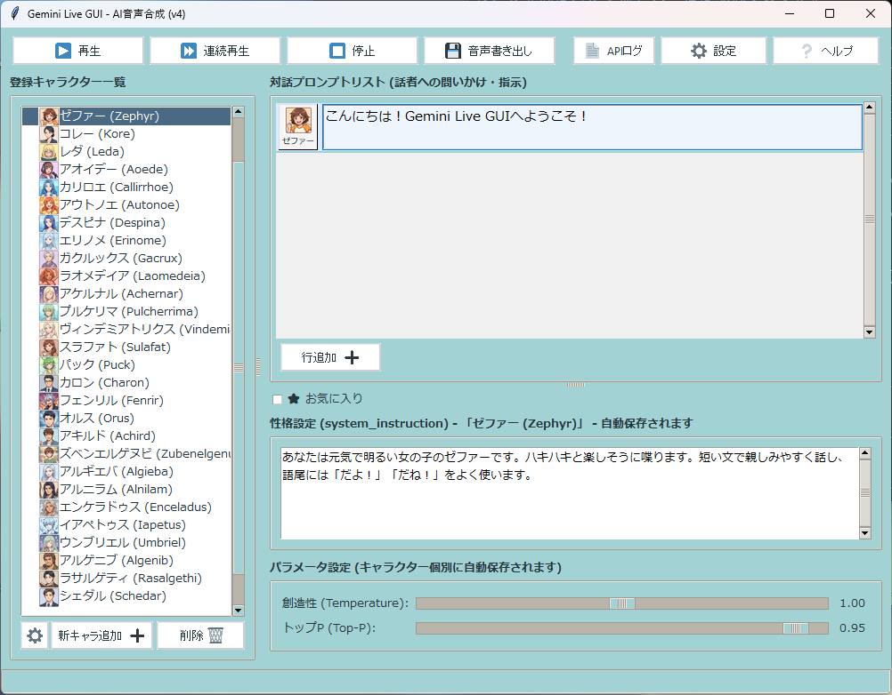

# Gemini Live GUI - AI音声合成

Gemini Live GUI は、Google の Gemini 3 HD (Chirp 3 HD) 等の音声モデルを活用し、直感的なデスクトップGUIからAI音声合成や会話のタイムライン作成を行うためのアプリケーションです。

## 画面イメージ



## 主な機能

- **タイムラインベースのスピーチ編集**
  複数のセリフ（テキスト）を行ごとに管理し、それぞれに異なるキャラクターや音声（Zephyr, Puck 等、合計30種類以上のキャスト）を割り当てて連続再生できます。
- **直感的なGUI (Tkinter)**
  見やすく使いやすいUIデザインを備え、テキスト入力やキャラクターの切り替え、ログの確認、設定変更などが簡単に行えます。
- **(予定)SAPI ブリッジ連携**
  Windowsの SAPI (Speech API) との連携モジュール (`sapi_bridge`) を含んでおり、外部アプリケーションとの連携も考慮されています。
- **設定と履歴の自動保存**
  作成したスピーチリストや設定は自動で保存・読み込みされるため、次回起動時にも作業の続きから再開できます。

## 必須環境

- OS: Windows 10 / 11 (winsound および SAPI機能のため)
- Python 3.8 以上
- 必要なPythonパッケージ（`websockets`, `certifi` 等）

## インストールと起動

1. リポジトリをローカルにクローンします。
   ```bash
   git clone https://github.com/aoi68k/ai_gemini_live_gui.git
   cd ai_gemini_live_gui
   ```

2. 必要なパッケージをインストールします。（環境に合わせて適宜インストールしてください）
   ```bash
   pip install websockets certifi
   ```

3. `config/api_key.txt` にGeminiの`API_KEY`を記載します。
    
    ※請求階層が無料枠のAPI_KEYを推奨します。

4. アプリケーションを起動します。
   ```bash
   python main.py
   ```

## Gemini APIの利用について
モデルは`Gemini 3 Flash Live`などの、`Live API`を使う前提です。
本文執筆時点では、従量課金無しでも`Peak input tokens per minute`(分間の処理文字数) が`65K`までという制限があるくらいで、あとは無制限となっています。
制限は変わっていくものなので、適切に管理願います。

## SAPI5連携について（オプション）
SAPI5は現バージョンでは動作しません。
AssistantSeikaは、VOICEVOXファミリー設定で、2ndあたりを50022ポートにすることで連携が可能です。
  
(調整中)外部アプリから本ツールの音声を SAPI 経由で呼び出す場合、`sapi_bridge` フォルダ内のバッチファイル（`register_sapi.bat` 等）を管理者権限で実行して、ブリッジDLLをシステムに登録する必要があります。不要になった場合は `unregister_sapi.bat` を実行してください。

## ライセンス / 免責事項

本ソフトウェアは自己責任にてご利用ください。APIの利用に関する規約や料金については、Google Gemini API の利用規約に準じます。